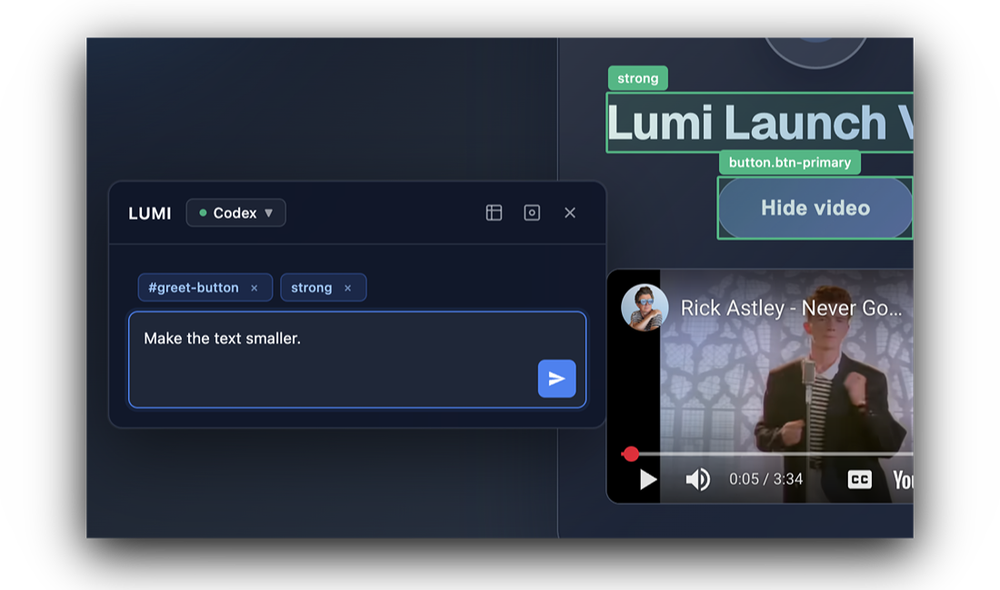

<p align="center">
  
</p>
<p align="center">
  <strong>👀 See it. Click it. Fix it.</strong>
</p>
<p align="center">
  
</p>

## Overview

**Lumi** is a Chrome extension that lets you edit your web app directly in the browser.  
No more typing long prompts or guessing element names — just click what you see, tell Lumi what you want, and your coding agent (like Codex or Claude Code) makes the change precisely.


## Requirements
- Node.js 20+
- Chrome 115+
- At least one CLI: Codex and or Claude Code CLI

## Quick Start
1. **Install & seed config**
   ```bash
   npm run setup
   ```
   Installs dependencies for `extension/` and `server/`, asks where to store `config.json`, and checks that the CLIs are visible on your `$PATH`.

2. **Run the bridge**
   ```bash
   npm run dev
   ```
   The server listens on `http://127.0.0.1:3456` (use `LUMI_PORT=4567 npm run dev` if you need another port).

3. **Build & load the extension**
   ```bash
   npm run build
   ```
   Then load the `extension/` folder as an unpacked extension via `chrome://extensions`.

## Configure
Open the extension Options Page. 

- **Connection**: server URL + default engine.
- **Projects**: map host patterns (supports `*`) to absolute working directories. Pages that do not match any project cannot submit changes.
- **Codex / Claude**: set models, sandbox/permissions, extra CLI flags, and tool checkboxes.
- **Test** button in the header pings `/health`; the banner/toast will show success or failure in a few words.

## Daily Use
1. Keep the server running (`npm run dev`).
2. Visit a mapped host and click the LUMI icon to inject the bubble.
3. Select DOM nodes or grab a screenshot, type your instruction, choose an engine, and send.
   - If you capture a screenshot, the server saves it and (for Claude) appends the local path to the prompt so Claude can inspect it.
4. Watch the bubble for status and review the server log (`~/.lumi/server.log`) if anything fails.

## Troubleshooting
- **Port busy** → `lsof -nP -iTCP:3456` then kill the process, or run with a different `LUMI_PORT` and update the Options Page.
- **CLI not found** → ensure `codex --version` / `claude --version` work in the same shell; delete `<configDir>/cli-capabilities.json` to refresh detection.
- **“Not configured for this page”** → add the current host in the Projects panel and save.

Happy building ❤️
