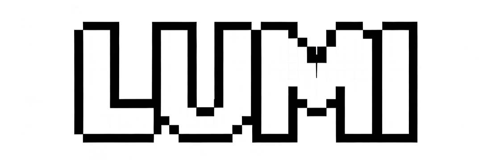

<p align="center">
  
</p>
<p align="center">
  <strong>👀 See it. Click it. Fix it.</strong>
</p>
<p align="center">
  
</p>

## What is LUMI

**LUMI gives your AI coding agent vision.**

Instead of describing what's on your screen, you **show** it. Click any element, add a comment, and let your AI see exactly what you mean.

LUMI is a Chrome extension that connects directly to AI coding agents like **Codex** and **Claude Code**, enabling true visual collaboration. Your AI can now see your UI, understand context from screenshots, and make precise changes without guessing selectors or navigation paths.

## Features

✨ **Visual Selection** - Click any element on your page to select it instantly  
📸 **Screenshot Annotations** - Capture and annotate with a floating glass toolbar  
🎯 **Direct Editing** - Edit colors, text, spacing, and styles with live preview in a glassmorphic modal  
🤖 **AI-Powered Changes** - Natural language instructions transformed into code  
🔄 **Session Management** - Keep track of multiple conversations and changes  
⚡ **Works Everywhere** - Any web app, any framework, any stack


## Requirements
- Node.js 20+
- Chrome 115+
- At least one CLI: Codex CLI and/or Claude Code

## Quick Start
1. **Clone the repository**
   ```bash
   git clone https://github.com/heyzgj/lumi
   cd lumi
   ```

2. **Install & seed config**
   ```bash
   npm run setup
   ```
   Installs dependencies for `extension/` and `server/`, asks where to store `config.json`, and checks that the CLIs are visible on your `$PATH`.

3. **Run the bridge**
   ```bash
   npm run dev
   ```
   The server listens on `http://127.0.0.1:3456` (use `LUMI_PORT=4567 npm run dev` if you need another port).

4. **Build & load the extension**
   ```bash
   npm run build
   ```
   Then load the `extension/` folder as an unpacked extension via `chrome://extensions`.

## Configure

Open the extension Options Page. Here's what you need to know:

### **🔴 Must Configure (Projects)**
This is **the only section you need to change** for basic usage:

**Projects** - Tell LUMI where your code lives and which sites to work with
- Click "Add" and enter:
  - **Name**: Friendly name (e.g., "My Website")
  - **Working Directory**: Full path to your project folder
  - **Hosts**: Your development server URL (e.g., `localhost:3000`)

**Example for a typical React/Next.js project:**
```
Name: "My App"
Working Directory: "/Users/john/Documents/my-react-app"
Hosts: "localhost:3000"
```

### **🟢 Safe to Ignore (For Now)**
These sections work fine with defaults for most users:

**Connection**
- Server URL: `http://127.0.0.1:3456` ✅ (leave as default)
- Default Engine: Codex ✅ (or change to Claude if preferred)

**Codex/Claude Settings**
- Models, permissions, tools ✅ (defaults are good for beginners)
- Only tweak these if you know what you're doing or your AI suggests changes

### **Test Your Setup**
Click the "Test" button - should show "Connected" in green.

**Pro tip:** If you're unsure about any setting, ask your AI assistant! They can explain what each option does and help you find your working directory and host information.

## Daily Use
1. Keep the server running (from the project directory: `npm run dev`).
2. Visit a mapped host and click the LUMI icon in the bottom-right to open the Dock.
3. **Use the Dock to:**
   - **Select elements**: Click the cursor icon or press `Cmd/Ctrl+E`, then click any element on the page
   - **Annotate screenshots**: Click the camera icon or press `Cmd/Ctrl+S` to enter annotation mode
     - Use the floating glass toolbar to draw rectangles, arrows, text, or freehand
     - Click the checkmark to add the annotated screenshot to chat
   - **Edit directly**: Click any selected element's chip to open the edit modal
   - **Chat with AI**: Type your instruction in the composer, choose an engine, and send
4. **Session management**: Switch between "Chat" and "History" tabs to manage multiple conversations.
5. Watch the Chat timeline for status updates and review the server log (`~/.lumi/server.log`) if anything fails.

## UI Features
- **Premium Glass Design**: The entire UI uses a translucent glassmorphism aesthetic with floating shadows
- **Dark/Light Theme**: Toggle between modes using the sun/moon icon in the Dock header
- **Micro-interactions**: Buttons lift on hover and compress on click for satisfying feedback
- **Copy Prompt**: Click the clipboard icon to copy the current prompt with all context

## Troubleshooting
- **Port busy** → `lsof -nP -iTCP:3456` then kill the process, or run with a different `LUMI_PORT` and update the Options Page.
- **CLI not found** → ensure `codex --version` / `claude --version` work in the same shell; delete `<configDir>/cli-capabilities.json` to refresh detection.
- **"Not configured for this page"** → add the current host in the Projects panel and save.
- **Dock not appearing** → Reload the page and click the launcher orb in the bottom-right corner.

Happy building ❤️